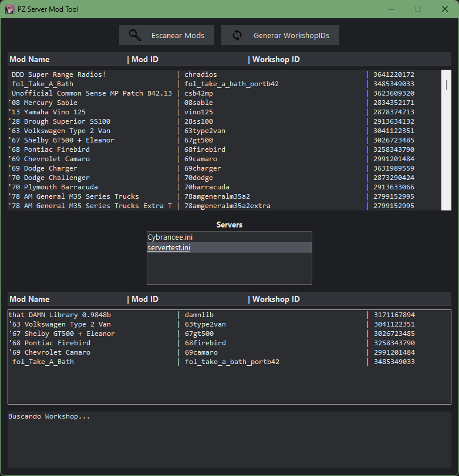

# PZ Server Mod Tool

## Preview


Herramienta gráfica para gestionar mods de servidores de **Project Zomboid**.

---

## Descripción
Esta herramienta facilita la gestión de mods de servidores generando automáticamente los **WorkshopIDs** a partir de los mods activados en el archivo `.ini` del servidor.

Fue diseñada principalmente para **Build 42+**, pero también es compatible con versiones anteriores.

---

## Funciones
- Detección automática de instalación de Steam
- Escaneo automático de mods de Workshop
- Visualización de:
  - Mod Name
  - Mod ID
  - Workshop ID
- Sincronización automática con `server.ini`

---

## Cómo usar

1. Activa los mods desde el juego normalmente
2. Guarda el servidor
3. Abre la herramienta
4. Selecciona el `.ini`
5. Genera los WorkshopIDs automáticamente

---

## Requisitos
- Python 3.10+
- Steam instalado
- Project Zomboid instalado

---

## Estructura del proyecto
gui.py → interfaz gráfica
core/ → lógica del sistema
assets/ → iconos

## Ejecutar
```bash
python main.py